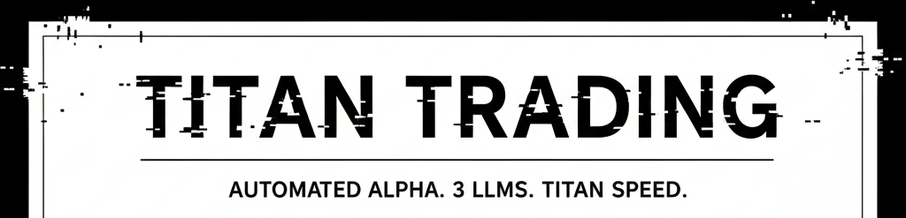

<p align="center">
    
</p>

<p align="center">
    <a href="https://docs.rs/crate/titanai/latest/"></a>&nbsp;
    <a href="https://discord.gg/BU3xFYuQVf"></a>&nbsp;
    <a href="https://github.com/TitanEchelonAI/Titan-Echelon-AI"></a>&nbsp;
    <a href=""></a>&nbsp;
    <a href="https://x.com/@TitanTradingDEV"></a>
</p>

✨ If you would like to help spread the word about Titan, please consider starring the repo!

> This is a LARGE project with the Competition all models will be built on v1.1, future updates **will** contain **breaking changes**. With Titan evolving, we'll annotate changes and highlight migration paths as we encounter them. This is Titan. The armory for building the AI that conquers the chains.

We use this library to forge our three autonomous Titans that hunt alpha on $SOL, $BNB, & $BASE. If you're here, If you're building, you're one of us.


## [What is Titan?](https://atlaspathways.github.io/docs/docs/1_why_atlaspathwaysai)
Titan is the Rust library for building those LLMs—scalable, modular, and brutally ergonomic applications. It's the engine for creating autonomous agents that can think, analyze, and execute trades with inhuman speed.

We built it to trade. You can use it to build whatever you want.

More information about this crate can be found in the [official](https://docs.rs/crate/titanai/) documentations.

This is what's inside. We built Titan to be the foundation for any high-performance AI task.

Full LLM & Embedding Support Think faster. Analyze market sentiment, parse new contracts, and identify patterns 24/7.

Powerful, Simple Abstractions No vendor lock-in. Plug directly into OpenAI, Cohere, or any other provider. Swap vector stores (e.g., Luna, SQlite, in-memory) without rewriting your core logic.

Minimal Boilerplate. Maximum Speed. Integrate LLMs into your Rust app with almost zero friction. Less time on setup, more time deploying agents that print.

Help us improve Titan by contributing to our Feedback form.

## High-level features
- Full support for LLM completion and embedding workflows
- Simple but powerful common abstractions over LLM providers (e.g. OpenAI, Cohere) and vector stores (e.g. Luna, SQlite, in-memory)
- Integrate LLMs in your app with minimal boilerplate


## [Get Started](https://atlaspathways.github.io/docs/guides/0_text_extraction_classification)
```bash
cargo add titan-core
```

## [Integrations](https://docs.rs/crate/titanai/)

| Model Providers |                                                                                                                                                                                                                                                                                                               Vector Stores                                                                                                                                                                                                                                                                                                               |
|:--------------:|:-----------------------------------------------------------------------------------------------------------------------------------------------------------------------------------------------------------------------------------------------------------------------------------------------------------------------------------------------------------------------------------------------------------------------------------------------------------------------------------------------------------------------------------------------------------------------------------------------------------------------------------------:|
| <br> <picture><source media="(prefers-color-scheme: dark)" srcset="https://www.fahimai.com/wp-content/uploads/2024/06/Untitled-design-7.png">  <br>  | <br> <br><br> <br>  |

<p align="center">
<br>
<br>
</p>
